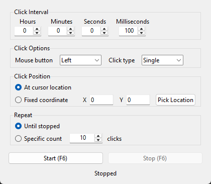

# 🖱️ Auto Clicker

[](https://www.python.org/)
[](LICENSE)
[](#)

A simple, open-source, **cross-platform** auto clicker. Written in Python with
Tkinter; its only dependency is [`pynput`](https://pypi.org/project/pynput/).
It lives in a single file, so it is easy to read and modify.

## ✨ Features

- ⏱️ **Configurable click interval** — hours / minutes / seconds / milliseconds.
- ⌨️ **Global keyboard shortcut** — start/stop with **F6**, even while the app is in the background.
- 🖱️ **Click type & button** — left / right / middle button, single or double click.
- 📍 **Click position** — at the cursor's current location or at a fixed coordinate (X/Y).
  Use the "Pick Location" button to capture the cursor position.
- 🔁 **Repeat limit** — click until stopped, or a specific number of times.

## 📦 Installation

Requires Python 3.7+.

```bash
# Clone the repository
git clone https://github.com/Krypera/auto-clicker.git
cd auto-clicker

# (Optional) virtual environment
python -m venv .venv
# Windows:  .venv\Scripts\activate
# Linux/macOS:  source .venv/bin/activate

# Install the dependency
pip install -r requirements.txt
```

## 🚀 Running

```bash
python auto_clicker.py
```

### Usage

1. Set the click interval (e.g. 100 ms).
2. Choose the mouse button and click type.
3. Decide whether to click at the cursor location or at a fixed coordinate.
4. Choose unlimited clicks or a specific count.
5. Press **Start** or use the **F6** shortcut. To stop, press **F6** again or **Stop**.

## 🖥️ Platform Notes

- **Windows** — no extra setup required.
- **macOS** — on first run you must grant Python (or your terminal) permission under
  **System Settings → Privacy & Security → Accessibility**; otherwise mouse/keyboard
  events will not work.
- **Linux** — an **X11** session is required. Global shortcuts and mouse control may be
  limited under Wayland.

## 🗂️ Project Structure

```
auto-clicker/
├── auto_clicker.py   # The whole app (GUI + click logic + hotkey)
├── requirements.txt  # pynput
├── README.md
├── LICENSE           # MIT
└── .gitignore
```

## 📸 Screenshot



## ⚠️ Disclaimer

This tool is intended for legal and personal use only (automating repetitive tasks,
testing, accessibility, etc.). Using it in a way that violates the terms of service of
third-party services or games is the user's responsibility.

## 📄 License

[MIT](LICENSE) — use, modify, and distribute as you wish.
